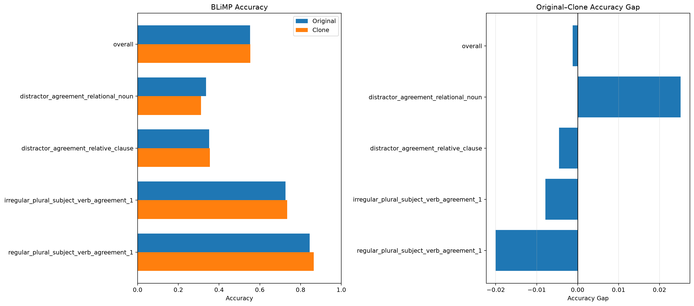
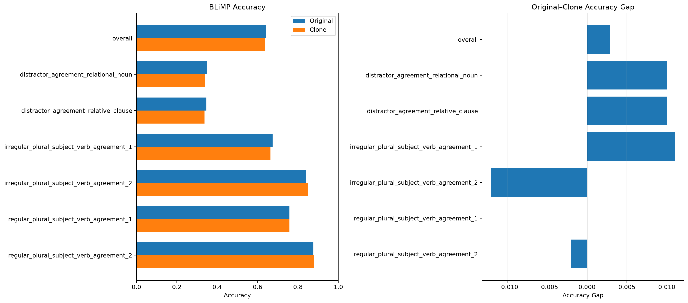

# Subject–Verb Agreement

## 严格 verb-logit 评估

严格指标只保留以下样本：

1. correct 与 incorrect verb 都是一个 SentencePiece token；
2. 两个候选动词位于完全相同的 tokenized prefix 后；
3. 分数严格为 `logit(correct) - logit(incorrect)`。

| 子任务 | N | Original | Clone | Original margin | Clone margin |
|---|---:|---:|---:|---:|---:|
| Overall | 1,655 | 55.23% | 55.35% | 0.438 | 0.532 |
| Relational-noun distractor | 437 | 33.64% | 31.12% | -0.624 | -0.710 |
| Relative-clause distractor | 439 | 35.08% | 35.54% | -0.653 | -0.666 |
| Irregular agreement 1 | 380 | 72.63% | 73.42% | 1.264 | 1.489 |
| Regular agreement 1 | 399 | 84.46% | 86.47% | 2.017 | 2.300 |

总体 accuracy 只略高于随机水平，而且主要由两个简单子任务拉高。两个 distractor
子任务显著低于 50%，显示出系统性的 agreement attraction：模型更容易跟随距离动词
最近的名词，而不是句法上的主语。

例如：

> The brochures about Harvard University **were** irritating Tracy.

模型容易被最近的单数名词 `University` 吸引，错误偏好 `is`。关系从句中也出现同样
模式，例如主语是 `organization`，但模型会受到从句中的复数 `customers` 影响。

## Conditional-logprob 评估

| 子任务 | Original | Clone |
|---|---:|---:|
| Overall | 64.12% | 63.83% |
| Relational-noun distractor | 35.10% | 34.10% |
| Relative-clause distractor | 34.70% | 33.70% |
| Irregular agreement 1 | 67.50% | 66.40% |
| Irregular agreement 2 | 83.90% | 85.10% |
| Regular agreement 1 | 75.80% | 75.80% |
| Regular agreement 2 | 87.70% | 87.90% |

Conditional 评估覆盖全部 6,000 个样本，但允许多 token verb，并累加各 token 的
log-probability，因此会受到 tokenization 长度和词频影响。64% 不能替代严格 raw-logit
指标，也不能掩盖 distractor 子任务低于随机水平的问题。

## Original 与 clone 是否等价

两种语言的总体准确率没有显著差异：严格评估的配对检验约为 `p=0.94`，conditional
评估约为 `p=0.56`。这是语言训练量均衡的正面证据。

但预测不是完全对称：

- 严格预测一致率为 90.21%；
- conditional 预测一致率为 87.25%；
- clone 的 mean margin 更大，但 accuracy 没有稳定提高。

因此更准确的结论是“平均能力相近”，而不是“逐样本完全等价”。

## Strict 子集限制

严格评估排除了 4,345 / 6,000 个样本：

| 原因 | 数量 |
|---|---:|
| Correct verb 不是单 token | 2,033 |
| Incorrect verb 不是单 token | 312 |
| 两个句子前缀不同 | 2,000 |

最终只保留 27.6% 的样本和四个子任务，因此 strict overall 不应被描述为完整 BLiMP
SVA 分数。
