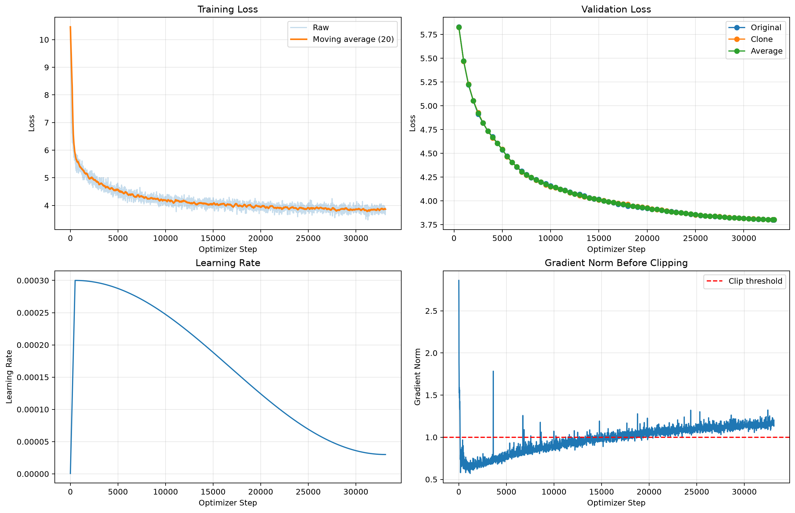
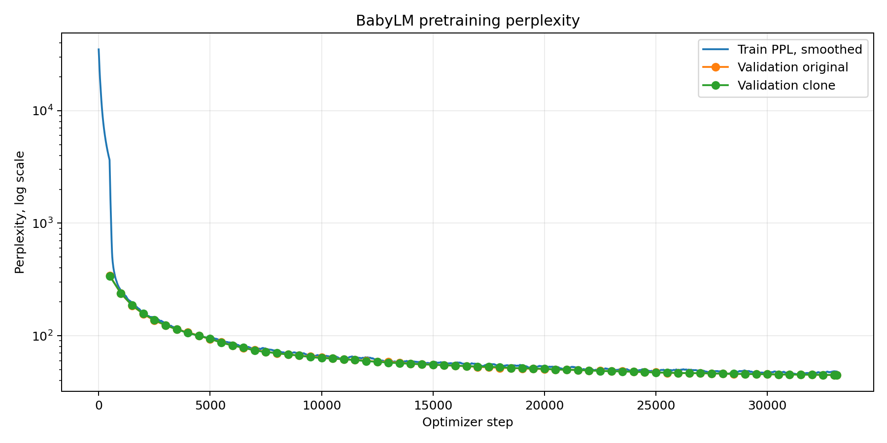

# 预训练结果

## 配置与数据量

| 配置 | 数值 |
|---|---:|
| Layers | 12 |
| Hidden size | 512 |
| Attention heads | 8 |
| FFN size | 2,048 |
| Context length | 256 |
| Base / model vocabulary | 16,000 / 32,000 |
| Dropout | 0.1 |
| Micro batch / accumulation | 4 / 8 |
| Tokens per optimizer step | 8,192 |
| Peak / minimum learning rate | 3e-4 / 3e-5 |
| Warmup | 500 steps |

训练集 tokenize 后包含 135,639,868 tokens。总共训练 271,286,272 tokens，
original 与 clone 分别看到 135,540,992 和 135,745,280 tokens。

配置中的 `target_epochs: 2.0` 是两种语言混合后的总量。因为 `p_clone: 0.5`，
每种 token-ID 空间平均只看到约一个数据集 epoch，而不是各看到两个 epochs。

## Loss、学习率与梯度

Validation loss 从 step 500 的 5.8279 降至最终的 3.8017，最优验证点就是最后一步
33,116。这说明没有观察到验证 loss 反弹，但也表明模型在停止时仍有缓慢改善空间。

图中的 gradient norm 是 clipping 之前的值。训练后半段大多数 step 超过阈值 1.0，
因此 gradient clipping 经常生效。它防止了不稳定，但也说明后期更新长期处于受限状态，
继续训练时应同时观察 gradient norm，而不能只看 loss。

## Perplexity

| Validation metric | Original | Clone | 差值 |
|---|---:|---:|---:|
| Loss | 3.7998 | 3.8036 | 0.0038 |
| Perplexity | 44.69 | 44.86 | 0.17 |

Original 与 clone 的验证表现几乎重合，说明 50/50 的训练量控制是成功的。训练 PPL
略高于验证 PPL 并不直接表示异常，因为训练阶段开启 dropout，而验证阶段关闭 dropout。

不同实验间不能直接比较 PPL：BabyLM 与 TinyStories 使用不同语料和不同 tokenizer，
并且模型 vocabulary 从 8,192 增加到 32,000。
