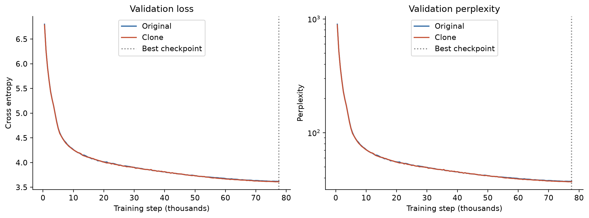
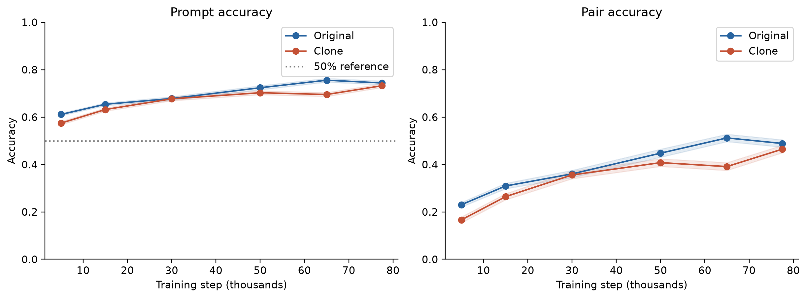
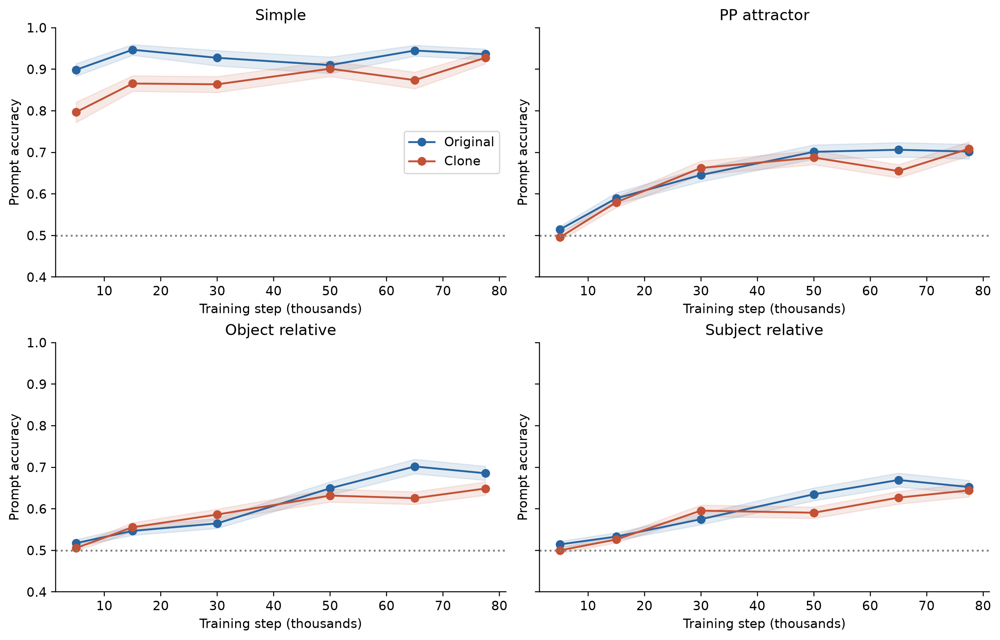
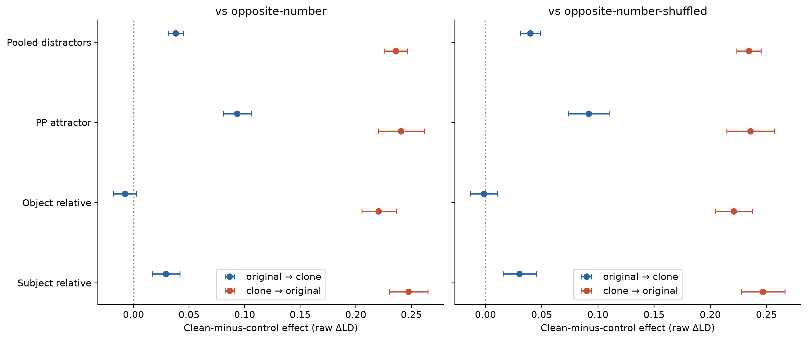
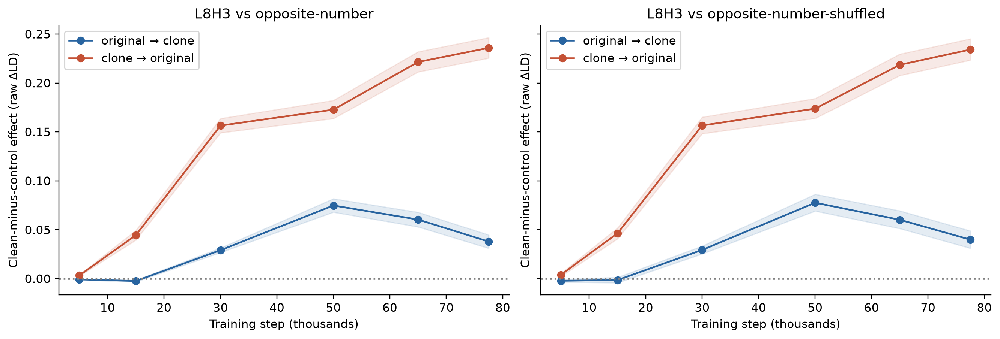
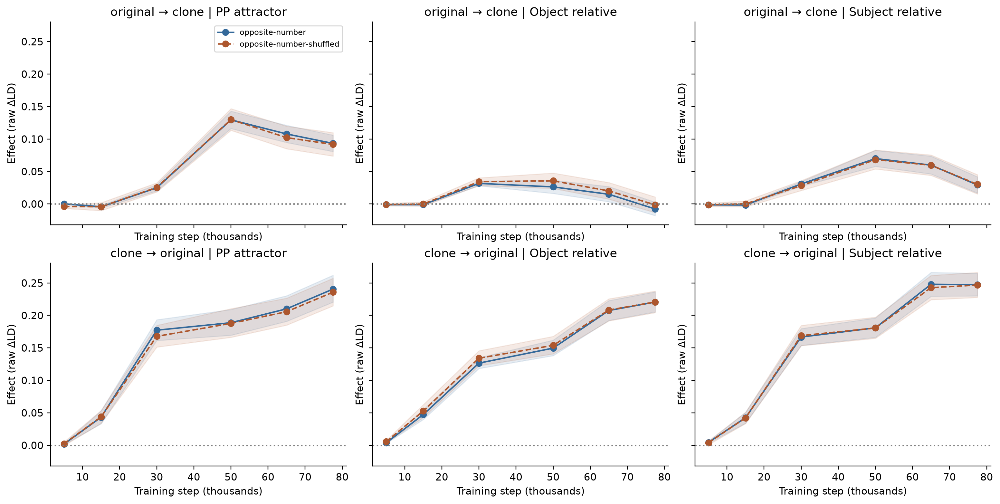
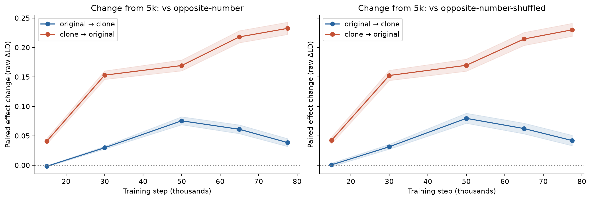
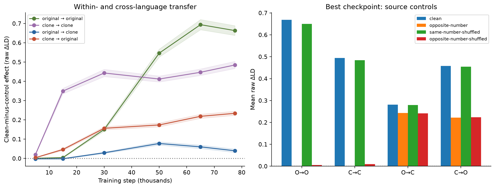
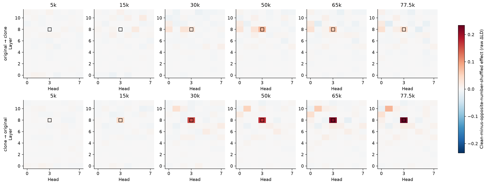
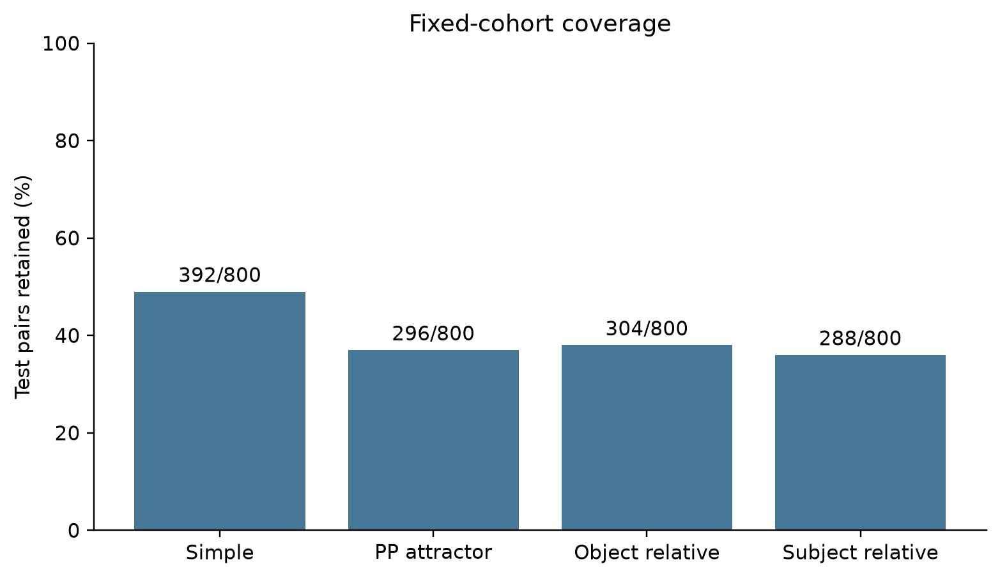

# 无共享 token IDs 的跨语言主谓一致机制：因果迁移证据与训练轨迹

研究报告 · 2026-09-24 · 中文正文，英文图表

本稿基于已经完成的 Wikipedia original/clone 实验及补齐的行为评估。新增消融与联合 patching 不属于本稿已完成的实验。

## 摘要

本项目检验：一个从零训练的 decoder-only Transformer，在英语与完全分离 token ID 空间的克隆语言上训练后，是否能在两种语言间直接传递与主谓一致（subject–verb agreement，SVA）有关的信息。模型包含 12 层、每层 8 个 attention heads，参数量约 54.3M。我们使用 tokenizer 对齐的受控 SVA 测试集，在 prediction position 对 attention head 输出执行四方向 activation patching。所有 checkpoint 使用相同的 1,280 对干预样本，避免因不同训练阶段筛选不同的成功样本而混淆轨迹。

在 validation-selected best checkpoint（77,500 steps），L8H3 的跨语言 clean patch 相对 opposite-number-shuffled 对照，在 888 对含干扰名词结构的样本上得到正效应：original→clone 为 **0.0399**，clone→original 为 **0.2342**；按提示分组的 95% bootstrap CI 分别为 **[0.0311, 0.0489]** 和 **[0.2234, 0.2452]**。两种 number 对照均支持 pooled 正效应，PP attractor 与 subject-relative 两类结构中双向复现；object-relative 的 original→clone 结果不明确。六个 checkpoint 的探索性轨迹显示方向不对称：clone→original 的效应在已观测时间点持续增长，original→clone 在 50k 达到观测峰值后回落。

这些结果支持：**在本模型、本任务及固定测试 cohort 中，即使两种语言不共享 token IDs，L8H3 的输出仍包含可跨语言利用的 SVA 信息。** 它们不等同于完整 circuit 的重建，也不能确证“无 circuit→语言专属→语言无关”的三阶段形成过程。

## 1. 研究问题与背景

主问题是两种 token 空间能否共享可用于语法判断的内部信息，而不只是两种语言的任务准确率是否接近。Dufter 与 Schütze 的工作提供了研究多语言性条件的背景；Ferrando 与 Costa-jussà 在 Gemma 的英语/西班牙语 SVA 中研究了相关机制及跨语言干预。本项目将问题限定在从零训练的、token IDs 分离的英语/克隆语言设置中。[Dufter & Schütze, 2020](https://aclanthology.org/2020.emnlp-main.358/)，[Ferrando & Costa-jussà, 2024](https://aclanthology.org/2024.findings-emnlp.591/)

我们区分三个问题：

1. **行为能力**：模型是否能在两种语言中预测正确的动词数？
2. **跨语言因果迁移**：将 source 语言的内部 activation 放入 target 语言，是否能改变其动词偏好，而且优于数信息对照？
3. **训练轨迹**：这种效应在已保存的 checkpoint 间怎样变化？

第三个问题为探索性补充。三阶段形成过程是待检验的设想，不作为筛选或解释结果的前提。

## 2. 模型、语料与任务

### 2.1 预训练设置

模型使用 12 层 decoder-only Transformer、8 heads/layer、hidden size 512、FFN size 2,048、context length 256。SentencePiece BPE 的 original 词表大小为 16,000；clone 对非 PAD token IDs 加 16,000，模型词表大小为 32,000。PAD 保留原 ID；这不构成共享词汇 subwords。模型参数、位置编码和结构共享，因此“没有共享 token IDs”不表示两种语言的全部结构独立。

预训练使用 English Wikipedia `20231101.en`，revision 为 `e6057dc557255a03c9c3c47ceab0eb44353b1bc5`。项目记录的训练集为 100,001,395 words，tokenized train 为 158,841,802 base tokens；validation/test 各约 1M words。original/clone 以 0.5/0.5 概率混合。训练 seed 为 42，总计 77,560 steps、635,371,520 seen tokens。优化器学习率峰值为 3e-4，warmup 500 steps，weight decay 0.1，micro batch 4、gradient accumulation 8。

Best checkpoint 依据训练期间两种语言平均 validation loss 选择，位于 **77,500** steps；它不一定是 SVA 准确率或某一迁移方向最优的 checkpoint。完整 held-out test PPL 为 original **36.910**、clone **36.851**，每种语言计分 1,584,201 个 next-token positions。训练曲线和 held-out PPL 说明语言模型训练有效，但不单独证明机制共享。

**图 1.** 两种语言的 validation loss 与 perplexity。虚线标记 best checkpoint。PPL 轴为对数刻度；训练结束步数与 best checkpoint 步数不同。

### 2.2 Controlled SVA v2

受控任务只用于评估，不加入预训练。v2 与模型 tokenizer 对齐，所有候选答案为单 token，clean/corrupted prompt 长度和 token 边界对齐；两种 prompt 仅改变主语数。Dev 为 400 pairs，test 为 3,200 pairs，dev/test 词汇清单分离。

测试集包含四类结构，每类 800 pairs：simple、PP attractor、object relative、subject relative。后三类含介于主语与预测位置之间的名词，用来检验模型是否能处理中间名词的影响。其 matched/mismatched 条件均包含在分析中；“pooled distractors”指三类结构汇总，不表示每个例子的中间名词都与主语数冲突。

行为评估报告完整 3,200 pairs。Patching 的 shuffled controls 要求在 task、prompt length、number 约束下进行无自配对轮换；固定实验最终保留 1,280 pairs，覆盖率为 **40%**。`selection=all`，不要求这些样本在各 checkpoint 都预测正确。

| 结构 | 全测试集 pairs | Patching pairs | 覆盖率 | 不同提示组数 |
|---|---:|---:|---:|---:|
| Simple | 800 | 392 | 49% | 89 |
| PP attractor | 800 | 296 | 37% | 291 |
| Object relative | 800 | 304 | 38% | 299 |
| Subject relative | 800 | 288 | 36% | 284 |
| 合计 | 3,200 | 1,280 | 40% | 963 |

提示组以一对 clean/corrupted prompt 文本为键，不区分两者顺序，因此将不同动词答案但相同提示的行分在一起。Pooled distractors 为 888 pairs、874 个提示组。

## 3. 干预与统计方法

### 3.1 Activation patching

我们保存 source clean prompt 的 head 输出，将其直接复制到 target corrupted prompt 的对应 head 和 prediction position。采用 raw activation copy，不学习额外的跨语言映射。四个方向为 original→original、clone→clone、original→clone 和 clone→original。

本稿主分析位点为 **L8H3**（代码零起始索引，即第九个 block、第四个 head），来自先前 v1 within-language 分析，并在 v2 test 前写入冻结的候选 manifest。冻结的额外 dev-ranked heads 是 L10H2、L9H0、L11H7、L8H0、L11H0；本稿只将其作为探索性描述。Head 输出的 hook 位于 attention 的输出投影之前。每次现有实验只替换一个 head，不进行联合 patching 或消融。

对 target 语言，统一定义：

`LD = log P(source clean 数对应的动词 | target prompt) − log P(另一数对应的动词 | target prompt)`

`ΔLD = LD_patched − LD_target_corrupted`

`效应 E = ΔLD_clean-source − ΔLD_number-control-source`

**E 不是准确率提升百分比。** 它反映相对于对照，clean source activation 对 target 动词偏好的额外影响。轨迹主分析不用 normalized recovery：早期模型的 clean/corrupted LD 差值可能接近零，归一化会使数值不稳定。

### 3.2 对照

- **Clean**：同一个语义例子的 source clean activation。
- **Opposite-number**：同一个例子、相反主语数的 source activation。
- **Same-number-shuffled**：来自另一个匹配例子、相同主语数的 source activation。
- **Opposite-number-shuffled**：来自另一个匹配例子、相反主语数的 source activation。

同语言方向作为正参照。Same-number-shuffled 保留数信息，不是预期零效应的负对照。跨语言 opposite-number patch 本身也可能造成语言来源替换效应，因此不能只看 clean patch 的 raw ΔLD 是否为正；必须比较 clean-minus-control。

### 3.3 不确定性与推断范围

对同一批样本计算每个 checkpoint、direction、control 的配对差值，以 10,000 次 task-stratified bootstrap、seed 42 计算逐点 95% percentile CI。每种重采样方法内，各 checkpoint 和对照共享样本权重。另做 **prompt-cluster bootstrap**：按提示组重采样，保留组内全部行；各 task 权重固定为原始样本占比。图中的阴影和误差条展示这一组区间，普通 row-bootstrap 区间保存在 CSV 和 notebook 表格中。两者不是独立的重复实验。

与 5k 的变化先在逐样本层面求差，再配对 bootstrap。**轨迹分析是事后探索性分析，区间未经跨 checkpoint/direction/task 的多重比较校正。** 本稿不据此报告“首次显著形成于某一步”，也不把跨零区间解释为“不存在 circuit”。

历史 best-checkpoint confirmatory 统计单独归档；原实现的 Holm 校正范围仅为每个 site、direction、null 下的三个 distractor tasks，不能扩展为对所有 heads/checkpoints 的总体校正。其 bootstrap 反向尾部计数为零时，不代表真实 p=0；本稿优先报告效应与 CI，不依赖这些近似 p 值给出新的严格显著性结论。

## 4. 结果

### 4.1 SVA 行为随训练总体提高

**图 2.** 完整 3,200-pair 测试集上的 prompt accuracy 与 pair accuracy。Prompt accuracy 基于每对的两个提示；pair accuracy 要求两者都正确。每个时间点使用相同测试集，阴影为提示分组 bootstrap 区间。50% 线仅用于 prompt accuracy 参照。

| Step | Original prompt acc. | Clone prompt acc. | Original pair acc. | Clone pair acc. |
|---:|---:|---:|---:|---:|
| 5,000 | 61.12% | 57.45% | 23.03% | 16.62% |
| 15,000 | 65.41% | 63.19% | 30.94% | 26.44% |
| 30,000 | 67.83% | 67.70% | 36.03% | 35.59% |
| 50,000 | 72.39% | 70.28% | 44.78% | 40.78% |
| 65,000 | 75.56% | 69.53% | 51.22% | 39.12% |
| 77,500 | 74.41% | 73.23% | 48.88% | 46.47% |

两种语言总体提高，但存在回落。例如 original 在 65k 的准确率高于 validation-selected best；clone 在 65k 低于 50k。Best 的 prompt accuracy 差为 1.17 percentage points。这个差值是当前模型固定测试集上的观测，不能估计跨训练稳定的语言差异。

**图 3.** 各结构的完整测试集行为曲线，每类 800 pairs。Simple 表现明显较高，含中间名词的三类结构更难。因此不能以 simple 主导的汇总替代 distractor 分层分析。

### 4.2 Best checkpoint 存在局部、方向不对称的跨语言迁移

**图 4.** L8H3 在 best checkpoint 的 clean-minus-number-control 效应。每个点是 raw ΔLD 差值，误差条为提示分组 95% CI；虚线为零。Pooled 为三类 distractor 汇总，不包含 simple。

| 方向 | Opposite-number：E [95% CI] | Opposite-number-shuffled：E [95% CI] | N |
|---|---|---|---:|
| Original→clone | 0.0379 [0.0311, 0.0448] | 0.0399 [0.0311, 0.0489] | 888 |
| Clone→original | 0.2359 [0.2254, 0.2464] | 0.2342 [0.2234, 0.2452] | 888 |

两种 null 下两个方向的 pooled 区间均为正。换用按提示分组的区间没有改变这一判断。分结构结果显示其边界：

| 结构 | Original→clone：E [95% CI] | Clone→original：E [95% CI] |
|---|---|---|
| PP attractor | 0.0917 [0.0738, 0.1098] | 0.2357 [0.2147, 0.2572] |
| Object relative | −0.0013 [−0.0133, 0.0108] | 0.2207 [0.2043, 0.2375] |
| Subject relative | 0.0302 [0.0155, 0.0451] | 0.2467 [0.2277, 0.2663] |

此表使用 opposite-number-shuffled null。PP attractor 与 subject-relative 双向为正；object-relative 的 original→clone 缺少明确正证据。因此适合报告“局部的跨语言可迁移信息”，不适合报告“所有结构共享完全相同的 circuit”。两个方向的 raw LD 效应还受 target 语言输出尺度影响；其大小差异本身不能解释为共享信息量之比。

### 4.3 两个方向的训练轨迹不同

**图 5.** 六 checkpoint 上 L8H3 的 pooled distractor 轨迹，四方向和四对照始终使用同一 cohort。阴影为逐点提示分组 CI；连线不表示中间时间点经过测量。

| Step | Original→clone：E [95% CI] | Clone→original：E [95% CI] |
|---:|---|---|
| 5,000 | −0.0021 [−0.0035, −0.0007] | 0.0040 [0.0025, 0.0055] |
| 15,000 | −0.0014 [−0.0041, 0.0014] | 0.0464 [0.0408, 0.0519] |
| 30,000 | 0.0294 [0.0254, 0.0334] | 0.1566 [0.1482, 0.1652] |
| 50,000 | 0.0776 [0.0692, 0.0863] | 0.1738 [0.1639, 0.1842] |
| 65,000 | 0.0603 [0.0513, 0.0694] | 0.2186 [0.2077, 0.2296] |
| 77,500 | 0.0399 [0.0311, 0.0489] | 0.2342 [0.2234, 0.2452] |

此表使用 opposite-number-shuffled null。Clone→original 在六个观测点呈递增；original→clone 的均值在 50k 达到观测峰值，之后回落。30k 是当前采样网格中第一个两个 pooled 方向在两种 null 下逐点区间均为正的点，**但不能据此把形成时刻定位为 30k**：更早的 checkpoint 并不连续、分析未经跨点校正，而且尚未考察所有可能的机制位置。

**图 6.** 三类 distractor 的方向与对照分解。各结构的轨迹并不相同，pooled 曲线不能代表每类结构都同步变化。

**图 7.** 逐样本配对的相对 5k 效应变化。Best 相对 5k，在 opposite-number-shuffled 下 original→clone 的变化为 **+0.0420 [0.0332, 0.0510]**，clone→original 为 **+0.2301 [0.2192, 0.2412]**。这是固定 cohort 中的训练阶段差异，不能排除训练中输出尺度等因素共同变化。

### 4.4 对照与探索性定位

**图 8.** 左：相同指标下的同语言与跨语言轨迹。右：best checkpoint 的四类 source patch raw ΔLD；O/C 分别表示 original/clone。

同语言 clean-minus-opposite-number 效应为 original→original **0.6686**、clone→clone **0.4943**，大于对应跨语言效应。跨语言 opposite-number raw ΔLD 并不接近零：original→clone 的 clean/control 均值约为 **0.2810/0.2431**。因此若只报告 clean patch 的 0.2810，就会把对照也能产生的变化当成数信息迁移；本稿报告两者的差值 0.0379。

Same-number-shuffled 的均值与 clean 接近，例如 original→clone 为 0.2792 与 0.2810。这个描述与跨例子的数信息兼容，但没有进行等效性检验，不能据此断言两种条件相同或完全排除词汇作用。

**图 9.** 全部 heads 的探索性 pooled maps，统一色标，黑框标记 L8H3。数值为 clean-minus-opposite-number-shuffled raw ΔLD。该图呈现分布变化，不用于在 test 上重新挑选位点后声称独立确认。

## 5. 讨论与局限

**对核心问题的回答。** Best checkpoint 的两个方向、两种 number null 及至少两类 distractor 给出一致的局部正面证据。在这个不共享词汇 token IDs 的训练设置中，source L8H3 activation 可以被另一 token 空间的后续计算利用，改变 SVA 动词偏好。这比同语言热图相关性更直接，但还没有分离出纯粹的 number direction，也没有测定完整路径的必要性和充分性。

**对训练过程的回答。** 观察到的方向不对称和回落，提示应把共享机制的发展描述为具体的效应轨迹，而不是强行套入三阶段故事。行为准确率与 L8H3 迁移效应也不必同步：例如 original 的 65k SVA 准确率较高，但 original→clone 的 L8H3 迁移均值低于 50k。这里只有六个同一次训练的时间点，不能把这种对应关系解释为训练因果定律。

主要限制如下：

1. **单模型、单 seed。** Bootstrap 描述当前词表和模板集合中的重采样不确定性，不是跨训练误差，也不是自然语言间泛化。
2. **克隆语言。** 两种 token 空间共享语法、语义分布、模型参数和位置结构，结果不能直接推广到英语/中文等自然语言对。
3. **覆盖率与依赖。** 干预 cohort 仅覆盖 40% test。Simple 的 392 行只有 89 组不同提示；分组区间只处理重复提示，无法消除共享 subject lemmas、动词和四类有限模板的全部依赖。
4. **推断层级有限。** L8H3 是主要候选，但单 head patching 不构成完整 circuit 重建。未执行必要性消融、联合 patching、自然语言实验或多-seed 复现。
5. **早期指标与选择。** 保持固定 cohort，避免 success-only 筛选；使用 raw ΔLD，避免小分母。代价是这些均值也包含模型原本答错的例子，且跨 checkpoint/语言的 LD 尺度可能变化。
6. **统计边界。** 轨迹 CI 是探索性逐点区间。历史 bootstrap-tail p 值和局部 Holm 校正有明确适用范围，本稿不将其扩大为全局显著性或形成阶段判定。
7. **Tokenizer 学习语料。** 按项目已有记录，tokenizer 训练跳过了 42,276/139,394 条超长 article lines；LM tokenization 覆盖完整语料，但 tokenizer learning corpus 存在偏差，本轮没有重训。

**图 10.** 固定 patching cohort 的结构覆盖率。所有结构都有保留样本，但该 cohort 不是对完整测试集的均匀随机抽样。

## 6. 结论

目前结果支持一个范围明确的判断：**原始英语与分离 token IDs 的克隆语言之间，L8H3 存在可跨语言利用的 SVA 因果信息；这种迁移具有方向和结构依赖。** 补齐的六 checkpoint 结果显示其发展并非两个方向同步单调增强。已有证据构成报告的主结果，但不足以证明完整、普遍的共享 circuit 或三阶段形成过程。

后续若有时间，可以在 best checkpoint 上增加 L8H3 消融和冻结候选集合的联合 patching，分别补充部件贡献与组合效应证据。本稿不把这些未来实验写成已完成结果。

## 7. 结果来源与复现

所有新图均由 [cross_language_dashboard.ipynb](../../notebooks/cross_language_dashboard.ipynb) 生成，读取版本化紧凑表，无需访问模型文件即可重新画图。图表数据、来源 SHA-256、实际 checkpoint 步数和统计口径见 [data/manifest.json](data/manifest.json)。原始 activation 数组与 checkpoints 保留在原输出目录，不复制到报告包。

| 结果 | 紧凑数据 |
|---|---|
| 六 checkpoint 完整 SVA 与区间 | [behavior_full_test.csv](data/behavior_full_test.csv) |
| 固定 1,280-pair cohort 的行为补充 | [behavior_fixed_cohort.csv](data/behavior_fixed_cohort.csv) |
| L8H3 四方向、两 null、分结构 CI | [trajectory_effects.csv](data/trajectory_effects.csv) |
| 相对 5k 的配对变化 | [trajectory_changes_from_5k.csv](data/trajectory_changes_from_5k.csv) |
| 四类 source controls 的均值 | [control_means.csv](data/control_means.csv) |
| 历史 confirmatory 统计 | [historical_confirmatory.csv](data/historical_confirmatory.csv) |
| 冻结候选与全 head maps | [exploratory_heads.csv](data/exploratory_heads.csv)、[head_maps.csv](data/head_maps.csv) |
| 训练与 held-out PPL | [training_validation.csv](data/training_validation.csv)、[test_perplexity.csv](data/test_perplexity.csv) |

Trajectory patching 的六点为 5k/15k/30k/50k/65k/best。全测试集 SVA 使用相同六点；旧实验中的额外 75k SVA 不属于本稿与机制轨迹对齐的分析集合。

## 参考文献

- Dufter, P., & Schütze, H. (2020). *Identifying Elements Essential for BERT’s Multilinguality*. EMNLP. [论文页面](https://aclanthology.org/2020.emnlp-main.358/)
- Ferrando, J., & Costa-jussà, M. R. (2024). *On the Similarity of Circuits across Languages: a Case Study on the Subject-verb Agreement Task*. Findings of EMNLP. [论文页面](https://aclanthology.org/2024.findings-emnlp.591/)
